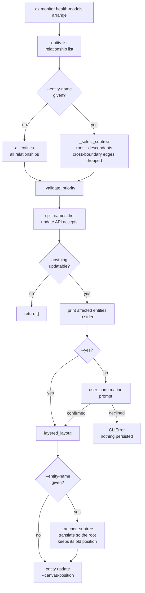
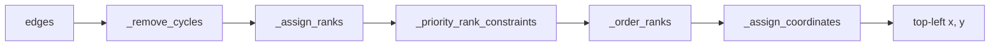
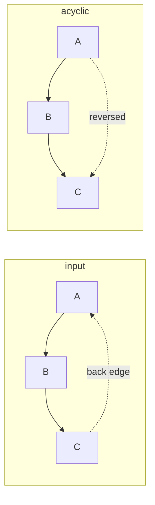
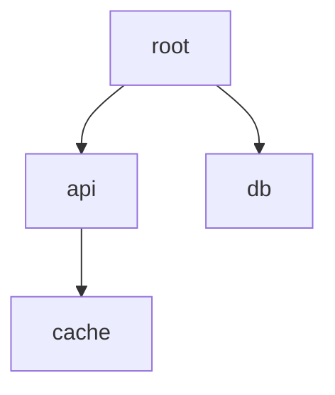
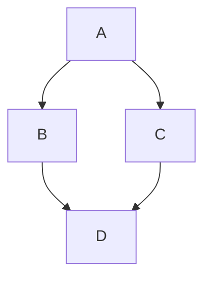
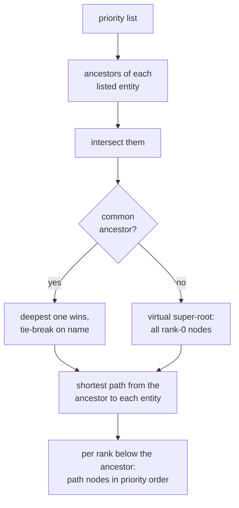
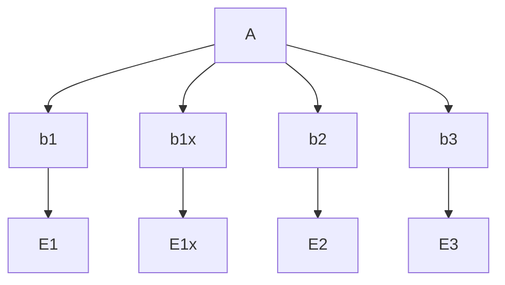

# `arrange` layout engine

How `az monitor health-models arrange` turns a health model's entity graph into
`properties.canvasPosition` values. The algorithm lives in `_layout.py`, which has no Azure
dependency. `custom.py` fetches the graph, confirms with you, and persists the result.

This is a from-scratch Python reimplementation of the layered layout behind the Azure Portal
Health Model Designer's **Arrange** button. The portal drives
[Dagre](https://github.com/dagrejs/dagre) with `direction=TB`, `nodesep=50`, `ranksep=100`. You
get an equivalent layout, not a byte-identical Dagre port: coordinates can differ from the portal
on graphs that are not trees.

## Command flow



The command writes nothing until you confirm. Pass `--yes`/`-y` to skip the prompt, which CI and
the recorded tests need because they have no tty.

## The layout pipeline

`layered_layout(nodes, edges, nodesep, ranksep, x_offset, y_offset, priority)` runs five stages.



| Stage | Function | Produces |
|---|---|---|
| 1. Break cycles | `_remove_cycles` | an acyclic edge set |
| 2. Assign ranks | `_assign_ranks` | `{node: rank}`, the vertical layer |
| 3. Build constraints | `_priority_rank_constraints` | `{rank: [node, ...]}` from `--priority` |
| 4. Order within ranks | `_order_ranks` | `{rank: [node, ...]}`, the left-to-right slots |
| 5. Place | `_assign_coordinates` | `x`, `y` per node |

A final conversion subtracts half the node width and height, because Dagre returns centre points
while `canvasPosition` is a top-left corner.

### 1. Break cycles

Health models can contain relationship cycles. An iterative DFS reverses back edges rather than
dropping them, so the relationship still informs ranking while the edge set becomes acyclic. The
traversal uses an explicit stack, so a large or deeply cyclic model cannot overflow it.



### 2. Assign ranks

Longest-path ranking via an iterative Kahn topological sort. Roots get rank 0, and every child
sits below all of its parents.

```
rank(node) = 0                             if the node has no parents
rank(node) = max(rank(parent)) + 1         otherwise
```

The vertical gap between consecutive ranks is `tallest node in the rank + ranksep`. With the
default 81-high card and `ranksep=100`, that comes to 181 canvas units.

Dagre uses a network-simplex ranker instead, which is the main reason results diverge from the
portal on graphs that are not trees.

### 3 and 4. Order within each rank

Crossing reduction by the median heuristic: four alternating sweeps, down then up then down then
up. Each sweep re-sorts a rank by the median slot index of that node's neighbours in the adjacent,
already-ordered rank. A node with no such neighbour keeps its previous relative position.

The iteration count is fixed rather than run to convergence, which keeps the result deterministic
and the runtime bounded.

> This stage outputs a **list per rank**, and that list order is the main lever on horizontal
> ordering. Stage 5 assigns coordinates in list order. The one thing that can still change the
> left-to-right result is the final gap-enforcement pass, and only on a rank shared by two
> disconnected components.

### 5. Assign coordinates

`y` is the cumulative rank offset. `x` starts as a left-to-right packing, `width + nodesep` apart.
Four iterations then pull each node toward the median x of its real parents and children in the
adjacent rank, while a forward sweep re-enforces the `nodesep` minimum gap so nodes never overlap
or swap.

`_normalize_rank_extents` finishes by aligning every rank of a connected component onto one shared
centreline, which is the centred look the portal produces. The component's widest rank is the
anchor, ties going to the lowest rank number. It normalises each component on its own, so a
disconnected component sharing a rank cannot skew another component's centre. A one-rank
component has nothing to align against and is left where the packing put it. Because two
components can shift into each other, a last pass re-sorts each rank by x and re-enforces the
`nodesep` gap.

## Worked example: a small tree



With the defaults (`200x81` cards, `nodesep=50`, `ranksep=100`):

| Entity | rank | x | y |
|---|---:|---:|---:|
| `root` | 0 | 0.0 | 0.0 |
| `api` | 1 | -125.0 | 181.0 |
| `db` | 1 | 125.0 | 181.0 |
| `cache` | 2 | 0.0 | 362.0 |

`api` and `db` sit 250 apart, which is `200 + nodesep`. `root` centres on their extent. `cache`
has one real parent so it aligns under `api`, then the shared-centreline pass pulls the component
onto x=0. Negative coordinates are normal, since the canvas has no origin constraint.

## Worked example: a diamond



| Entity | rank | x | y |
|---|---:|---:|---:|
| `A` | 0 | 62.5 | 0.0 |
| `B` | 1 | -62.5 | 181.0 |
| `C` | 1 | 187.5 | 181.0 |
| `D` | 2 | 62.5 | 362.0 |

`D` has two parents, so its rank is `max(1, 1) + 1 = 2` and its x lands on the median of `B` and
`C`.

## Priority ordering

`--priority e1 e2 e3` asks the layout to place those entities left to right in that order.

**Treat it as best effort.** The layout applies the order where the listed entities' branches meet
and hands the rest of the graph back to the median heuristic. It sets only the relative order, so
entities you did not list keep their place and can still appear between the ones you did:

```
Ep, E1, Ex, E2, Er, Et, E3      <- valid: E1 is left of E2 is left of E3
```

### How the layout derives the constraint



Ranks at or above the common ancestor stay untouched, as does any rank holding fewer than two
constrained nodes.

### How the layout applies it

`_apply_rank_constraint` performs a slot-preserving permutation. It collects the slot indices the
constrained nodes already occupy, sorts those indices, and rewrites them in priority order.
Everything else stays put:

```
rank before:   [ b1, bx, b2, b3 ]          constrained = b1, b2, b3 at slots 0, 2, 3
priority:      b3 < b2 < b1
rank after:    [ b3, bx, b2, b1 ]          bx never moved
```

This runs once before the median sweeps and again after every rank sort. The median heuristic uses
prior position only as a tie-break, so a constraint applied once would be overwritten.

### Worked example



Run `--priority E3 E2 E1`. `A` is the deepest common ancestor, and `b1x`/`E1x` are not listed.

| Entity | x without `--priority` | x with `--priority E3 E2 E1` |
|---|---:|---:|
| `A` | 375.0 | 375.0 |
| `b1` | 0.0 | 750.0 |
| `b1x` | 250.0 | **250.0** |
| `b2` | 500.0 | 500.0 |
| `b3` | 750.0 | 0.0 |
| `E1` | 0.0 | 750.0 |
| `E1x` | 250.0 | **250.0** |
| `E2` | 500.0 | 500.0 |
| `E3` | 750.0 | 0.0 |

`b1`/`b3` and `E1`/`E3` swap. `b1x`/`E1x` hold their slots and end up between listed entities. The
ancestor `A` does not move.

### When the order does not come out as asked

| Situation | What you get |
|---|---|
| Fewer than two listed entities | No constraint, layout unchanged |
| One listed entity is another's ancestor | No rank below the ancestor holds two constrained nodes, so the layout is unchanged |
| Listed entities at different depths | Their branch representatives are ordered at each shared rank. The deeper entity's own x follows from its branch, and is never compared against a shallower entity directly |
| Two listed entities share a path node | That node carries the lower priority index and appears once, so the two do not separate above the point where their paths split |
| Listed entities in different components | A virtual super-root stands in and every rank becomes eligible |
| Entity reachable by two equally short paths | The layout traverses sources and children in sorted name order, so the choice never depends on the order relationships arrived in |
| Unknown name in `--priority` | `custom.py` raises `InvalidArgumentValueError` before anything is written. The layout itself ignores ids it does not know |

## Entity names

`arrange` reads names from `entity list` and writes them back through `entity update`, whose
`--entity-name` argument only accepts `^[a-zA-Z0-9][a-zA-Z0-9-]{1,258}[a-zA-Z0-9]$`. Discovery
rules can create entities outside that pattern, such as a private endpoint NIC called
`pe-demo-queue.nic.1ae5fd05-...`.

`custom.py` reads that pattern from the generated AAZ schema and splits the selection before
writing anything:

- Entities the update API rejects appear in their own stderr warning and keep their current
  position.
- The layout still runs over the whole selection, including those entities, so everything that
  does get written is placed relative to the real graph.
- If no entity in the selection has a usable name, `arrange` returns without prompting.

For `--priority`, quote any name your shell would otherwise split:

```bash
az monitor health-models arrange -g rg -n model --priority "My Frontend" "My API"
```

## Defaults

| Constant | Value | Source |
|---|---:|---|
| `DEFAULT_NODESEP` | 50 | Portal `AutoLayoutDefaults.ts` |
| `DEFAULT_RANKSEP` | 100 | Portal `AutoLayoutDefaults.ts` |
| `DEFAULT_NODE_WIDTH` | 200 | `.react-flow__node { width: 200px }`, a fixed CSS rule |
| `DEFAULT_NODE_HEIGHT` | 81 | The portal's initial `measured` seed, not a fixed height |

Width is exact. Height is the value the portal seeds onto every entity card before the browser
measures it, and ReactFlow may replace it with a real rendered height that a headless CLI cannot
obtain. Override either with `--node-width` or `--node-height` if you know your model's rendered
size.

## What you can rely on

- **Determinism.** The same model produces the same layout on every run, whatever order the
  service returns entities and relationships in.
- **Totality.** Cycles, multiple parents, disconnected components, isolated entities and empty
  models all produce a defined result rather than an error.
- **Bounded work.** Fixed iteration counts, no recursion, no convergence loop. A 2000-node model
  lays out in about 20 ms.
- **No side effects when omitted.** `--priority` changes nothing unless you pass at least two
  names the model knows.

## What you cannot

- Byte-identical parity with the portal's Dagre output on graphs that are not trees.
- Any particular absolute origin. Coordinates are often negative.
- Stability across extension versions. `arrange` is experimental, it persists immediately, and the
  CLI has no undo.
