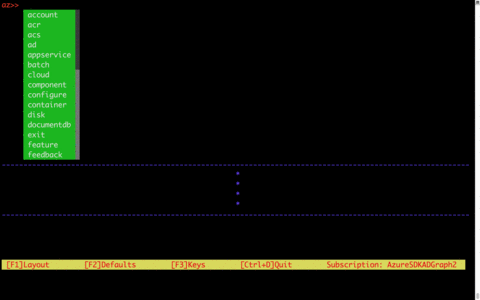
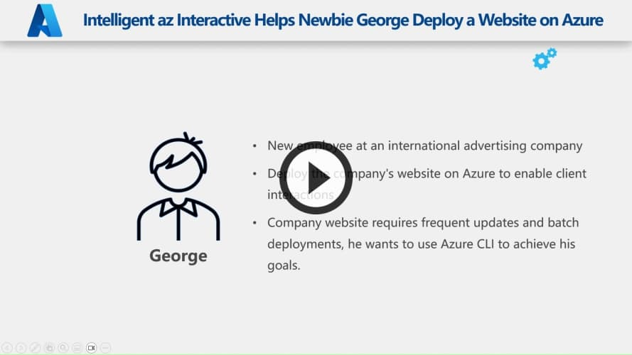
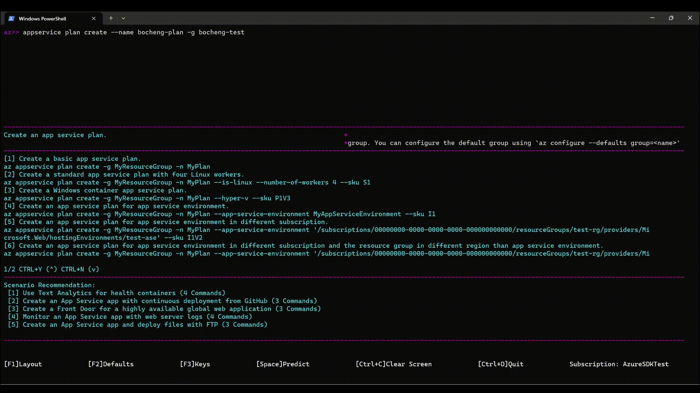
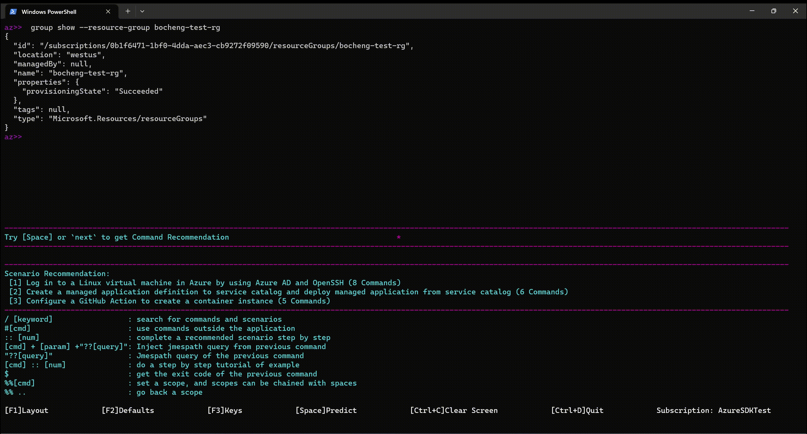
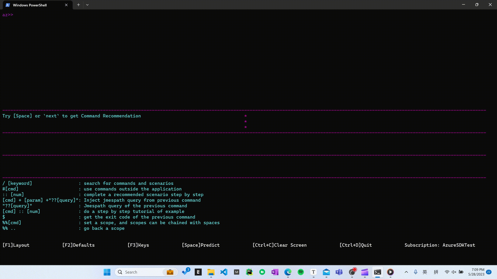

# Azure CLI Interactive Mode

## The interactive mode for Microsoft Azure CLI (Command Line Interface)

- Recommend Commands and Scenarios Based on Previous Commands
- Search for Scenarios
- Value Completion in Scenario Mode
- Interactive Tutorials
- Lightweight Drop Down Completions 
- Auto Cached Suggestions 
- Dynamic parameter completion 
- Defaulting scopes of commands
- On the fly descriptions of the commands AND parameters 
- On the fly examples of how to utilize each command 
- Query the previous command
- Navigation of example pane 
- Optional layout configurations 
- Optional "az" component 
- Fun Colors 




## Updates

Azure CLI Shell is now Azure CLI Interactive Mode. To get updates, install the newest version of the CLI! First, uninstall the deprecated shell applications with:

```bash
   $ pip uninstall azure-cli-shell
```

## Running

To start the application

```bash
   $ az interactive
```

Then type your commands and hit [Enter]

To use commands outside the application

```bash
   $ #[command]
```

To Search through the last command as json
jmespath format for querying

```bash
   $ ? [param]
```

*Note: Only if the previous command dumps out json, e.g. vm list*

To only see the commands for a command

```bash
   $ %% [top-level command] [sub-level command] etc
```

To undefault a value

```bash
   $ %% ..
```

To Search for a scenario

```bash
   $ /[keywords]
```

## Use Examples

Type a command, for example:

```bash
   $ vm create
```

Look at the examples

*Scroll through the pane with Control Y for up and Control N for down #*

Pick the example you want with:

```bash
   $ vm create :: [Example Number]
```

## Clear History

```bash
   $ clear-history
```

Only clears the appended suggestion when you restart the interactive shell


## Clear Screen

```bash
   $ clear
```


## Change colors

```bash
   $ az interactive --styles [option]
```

The color option will be saved.

# Intelligent AZ Interactive (Revolutionary Change)
## Recommendation

We have integrated the cli recommendation to make the completion ability more intelligent and provide the scenario completion. This is a revolutionary change. Users can enable or disable the recommendation feature by running the following commands:

```
$ az config set interactive.enable_recommender=True # Default, try the new recommendation feature
$ az config set interactive.enable_recommender=False # Disable the recommendation feature
```
Here is a demo video demonstrating the main features of the new az interactive:

[](docs/intelligent_az_interactive.mp4 "intelligent_az_interactive")

### Command Recommendation

Command recommendation uses an intelligent algorithm to suggest the most relevant and frequently used command for the user based on their historical command inputs. By analyzing the user's input history and matching it with the highest relevant commands, Intelligent Az Interactive can assist Azure CLI beginners in making quick and informed decisions, saving them time and effort.

The command recommendation feature can also be a good way to broaden users' knowledge boundaries and help them recognize and learn commands that are related to their common commands but never used before.

**Usage**: When you don't know what to do next, you can try entering only `Space` first, it will recommend the next command which is most used in other similar sessions.



### Scenario Identification

Scenario identification is another powerful feature that automatically recognizes the user's current scenario and recommends a set of commands that are most relevant to the user's needs. This feature is based on our extensive knowledge base which cover a wide range of use cases across various scenes. By analyzing the user's input history, Intelligent Az Interactive can identify the relevant scenario and suggest the most appropriate command set, helping new CLI users to quickly accomplish their tasks with confidence and ease.

**Usage**: You can enter `Space` and select the scenario *(the options with prefix `command set`)* you want to use. It will automatically execute the commands in the scenario and help you complete the task.



## Search Scenario Knowledge

We have added the ability to help users search for scenarios based on keywords. When the user enters some keywords or descriptions, we will recommend the scenarios that are most likely to be used based on the keywords and descriptions of the functions the user wants to implement.

**Usage**: You can use the natural language keywords with prefix `/` to search for the commands and usage scenarios you need, and smoothly create and execute corresponding CLI tasks.




## Loading Bar

The loading bar is a feature that we have implemented to provide users with a more stable and predictable experience while using our platform. Its primary function is to prevent command parameter detection errors that may occur due to incomplete loading. By displaying the progress of initialization through the loading bar, users can be assured that the initialization process is ongoing and they can expect to see a fully loaded interface once the bar reaches 100%.

Additionally, the loading bar helps prevent user interface lagging or freezing due to insufficient memory. By preloading the necessary resources and data, users can avoid encountering these issues when inputting commands. The loading bar is an essential tool that improves the user experience by ensuring that all necessary components have been loaded before usage, thereby reducing the risk of encountering errors and providing a smoother, more stable platform.

If you want to disable the loading bar, you can run the following command:
```bash
$ az config set enable_preloading=False
```
Please refer to the following gif to see the loading bar in action:


## Value Completion in Scenarios

We added a completion mechanism for parameter values in scenario execution *(corresponding to scenario identification or searching scenario knowledge)* to improve the completion ability of param value in
scenarios. In multiple commands of the same scenario, once the user enters a parameter value, we store the value entered by
the user based on the scenario sample value and some special global parameters, and automatically recommend the completion
of these parameter values in subsequent commands.

